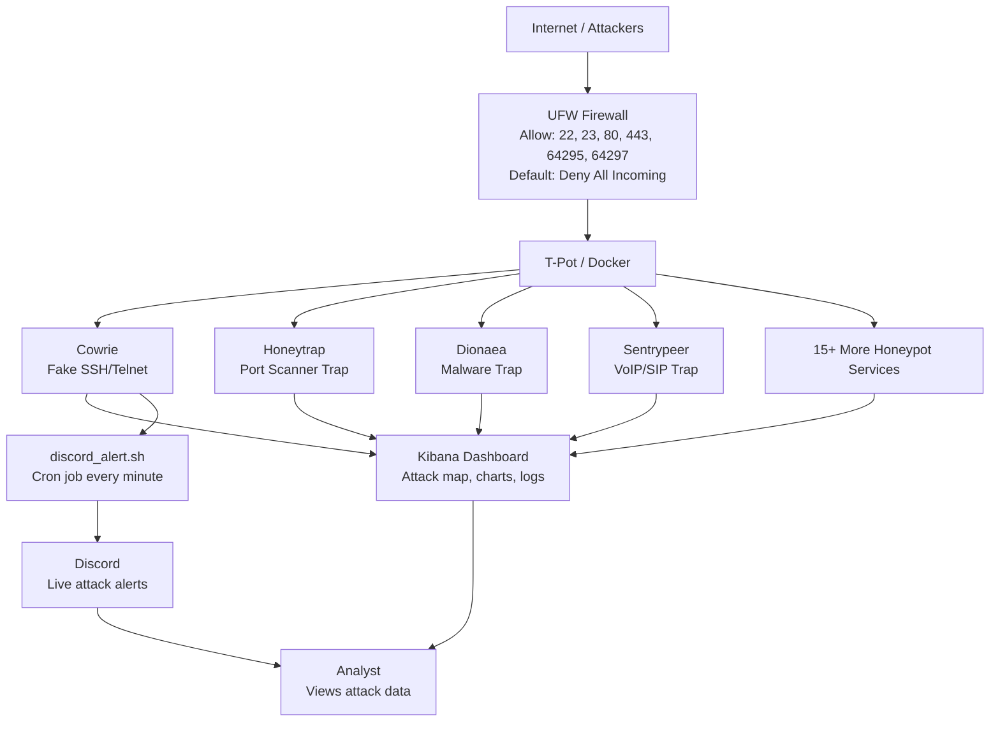

# Honeypot

A live honeypot deployed on a DigitalOcean cloud server to capture and analyze 
real-world attack behavior. Built using T-Pot (Telekom Security) on Ubuntu 24.04, 
the honeypot ran multiple trap services simultaneously including Cowrie (fake SSH), 
Honeytrap, Sentrypeer, Dionaea, and more — capturing over 55,000 attacks within 
32 hours of going live.

Attack data was visualized in real-time using an Elasticsearch/Kibana dashboard, 
revealing attacker origins, targeted ports, and credential attempts from across 
the globe. A UFW firewall was configured to control exposed attack surfaces while 
keeping management ports secured. Automated Discord alerts were set up via a webhook 
and cron jobs to deliver live attack notifications every minute.

## Server Architecture


### Flow Overview
- **Attackers** from the internet hit the **UFW Firewall** first
- UFW only allows traffic through on specific ports — everything 
  else is blocked by default
- Allowed traffic reaches **T-Pot's honeypot services** running 
  inside Docker containers (Cowrie, Honeytrap, Dionaea, Sentrypeer and more)
- All attack data is logged and visualized in the **Kibana Dashboard**
- Simultaneously the **discord_alert.sh** bash script runs every minute 
  via cron job, extracting Cowrie logs and sending live attack 
  notifications to **Discord**


## ⚙️ Specs & Security

### Cloud Server (DigitalOcean Droplet)
| Component | Requirement |
|---|---|
| **OS** | Ubuntu 24.04 LTS x64 |
| **RAM** | 8 GB minimum |
| **CPU** | 2-4 vCPUs |
| **Storage** | 160 GB SSD |
| **Region** | Any (Toronto used in this project) |
| **Provider** | DigitalOcean (or any cloud provider) |

### Software & Tools
| Tool | Purpose |
|---|---|
| **T-Pot (Telekom Security)** | Honeypot framework |
| **Elasticsearch & Kibana** | Attack data visualization |
| **Docker** | Runs all honeypot containers |
| **UFW** | Firewall configuration |
| **Cowrie** | Fake SSH/Telnet honeypot |
| **Discord Webhook** | Real-time attack alerts |
| **Cron** | Automated alert scheduling |
| **Git** | Cloning T-Pot repository |

### Secure Authentication
| Password Type | Purpose | Recommended Requirements |
|---|---|---|
| **DigitalOcean Root Password** | SSH access to the droplet as root | Min 8 chars, uppercase, lowercase, number, special character |
| **Non-Root User Password** | Daily server management as non-root user | Min 8 chars, uppercase, lowercase, number, special character |
| **T-Pot Web Password** | Login to Kibana/Elastic dashboard | Min 8 chars, no special characters (T-Pot restriction) |
| **Discord Webhook URL** | Authenticates alert script to Discord channel | Treat as a password — never share or commit to GitHub publicly |

## 🛠️Setup

### Step 1 — Create Droplet/ VPS

Cloud Provider: For this project, any cloud provider is fine, but I used DigitalOcean.


Pick Region: I picked Toronto because I am closest to it.


Choosing an image: For this project, I picked Ubuntu 24.04 LTS x64. DigitalOcean provides other images that would work fine for this project, like Debian, but since Ubuntu is directly supported by Telekom Security, I chose to go with it.


Authentication Method: SSH is a much safer option for authentication. In my case, I was only going to run this droplet for around 32 hours, and SSH is usually used for long-term servers. Using a password was quicker for the initial setup of the honeypot and worked better for analyzing real-time attack data. Thus, using a strong password is very important.


Improved Metrics Monitoring: For a server getting 1,800+ attacks an hour with 15+ T-Pot services running all at once inside Docker, it is very important to see whether the droplet can handle that attack load. This feature tracks network traffic, CPU usage, RAM consumption, and disk I/O.


---

## 🔗 T-Pot Repository

This project uses the official T-Pot framework developed by Telekom Security.
T-Pot is an all-in-one honeypot platform that runs 20+ honeypot services 
simultaneously inside Docker containers. If you would like to run these T-Pot services too, here is the GitHub repo link.

**Official Repository:** [Telekom Security T-Pot](https://github.com/telekom-security/tpotce)

---


---

## 🔥 UFW Firewall Configuration

To add an additional layer of security and control over the honeypot, 
UFW was configured on the droplet. The goal 
was to intentionally expose only the necessary ports to attract attackers 
while keeping management ports secured.

### Why UFW?
Without a firewall every port on the server is completely uncontrolled. 
UFW allowed full control over exactly what traffic could reach the server 
— blocking everything by default and only allowing specific ports through.

### Firewall Rules

| Port | Protocol | Reason |
|---|---|---|
| **64295** | TCP | New SSH management port (T-Pot changes default port 22) |
| **64297** | TCP | T-Pot Kibana dashboard access |
| **22** | TCP | Intentionally exposed — attracts SSH brute force attackers into Cowrie trap |
| **23** | TCP | Intentionally exposed — attracts Telnet attackers |
| **80** | TCP | Intentionally exposed — attracts HTTP based attacks |
| **443** | TCP | Intentionally exposed — attracts HTTPS based attacks |

### Key Detail
The default policy was set to **deny all incoming traffic** meaning 
any port not explicitly listed above is completely blocked. This gave 
full control over the attack surface while still allowing the honeypot 
traps to function properly.

### UFW Commands Used


### UFW Status


## Discord Webhook Alerts

To enable real-time attack monitoring, an automated Discord alert 
system was built using a bash script, a Discord webhook, and a cron job.

### `discord_alert.sh` 
```bash
#!/bin/bash
WEBHOOK_URL="Example URL"

ATTACKS=$(docker logs cowrie 2>&1 | grep "login attempt" | wc -l)
LATEST_IP=$(docker logs cowrie 2>&1 | grep "login attempt" | tail -1 | grep -oP '\d+\.\d+\.\d+\.\d+' | head -1)

curl -H "Content-Type: application/json" \
-d "{
  \"embeds\": [{
    \"title\": \"ALERT\",
    \"color\": 16711680,
    \"fields\": [
      {\"name\": \"Total SSH Attempts\", \"value\": \"$ATTACKS\", \"inline\": true},
      {\"name\": \"Latest Attacker IP\", \"value\": \"$LATEST_IP\", \"inline\": true}
    ],
    \"footer\": {\"text\": \"T-Pot HoneyPot Toronto\"}
  }]
}" \
$WEBHOOK_URL
```
### How the Script Works
You can find the code above inside `discord_alert.sh`. The script works by pulling live logs directly from 
the Cowrie Docker container and extracting two key pieces of information: the total number of SSH login attempts and the IP address of the most 
recent attacker. It then formats this data into a Discord embed card and 
sends it to a Discord channel using a webhook URL via a curl HTTP request. 
The webhook acts as a dedicated endpoint that Discord provides, allowing 
external services to post messages into a channel automatically without 
any manual input.

### Cron Job
After running the bash script, the Discord alert works, but you have to type `sudo bash /opt/discord_alert.sh` to manually trigger an alert. To automate this, I changed the cron file. This file lives directly on the Ubuntu droplet. Even after I close my laptop, I still get alerts on the attacks I want. To do this, I SSH'd into the root crontab. The cron job was added to root's crontab so it had full permissions 
to access the Cowrie Docker container logs without any authentication 
issues. I opened the crontab using the command `sudo crontab -e`. The five asterisks `* * * * *` represent minute, hour, day, 
month and day of week respectively. Setting all five to `*` means 
run every minute, every hour, every day — essentially running 
continuously in the background forever, or in my case, sending the newest attack every minute. It is worth noting that the first line is actually T-Pot's pre-set cron job that goes off at 1:12 AM; I wrote mine right underneath.


## Discord Alerts
To set this up, I first created a new Discord server and then created a dedicated channel for honeypot alerts. Inside that channel, I opened Channel Settings, navigated to **Integrations**, and created a new webhook named **messenger**. I then copied the webhook URL from Discord and pasted it into the `WEBHOOK_URL` field inside `discord_alert.sh`. This step must be completed before configuring the cron job; otherwise, the script can run on schedule but the alerts will not be delivered anywhere.

The following screenshots show the setup flow and the final alert outputs in Discord

<p align="center">
  
  
</p>

<p align="center">
  <em>Real-time attack alerts on desktop (top) and mobile (bottom)</em>
</p>


---

## Attack Data & Analasys

> **Observation window:** ~32 hours | **Deployment:** DigitalOcean VPS (Toronto region) | **Stack:** T-Pot CE on Ubuntu 22.04

The honeypot was left internet facing for 32 hours with decoy ports. I used Elastic and Kibana dashbooards to moonitor attack data passively. Below is all of the data I have gatehred!

## General Overview of Attacks

| Metric | Value |
|---|---|
| **Total Events Captured** | ~55,000+ |
| **Events in 24-hour window** | 51,768 |
| **Unique Attacking IPs (Cowrie/SSH)** | 25 |
| **Most Active Single IP (connections)** | 288 (143.110.165.82) |


What surprised me the most about the attacks was how quickly they happened. I observed within minutes of setting up my honeypot, my Elastic dashboard had already picked up an attack. For further context I was getiing 2 attacks every second. The internet has around 4.3 billion ip addresses! Attackers dont manually search them by hand, they use bots. If you deploy a server with open ports like I did, it will be found **immediatly**. Search engines like **Shodan and Censy** use bots that crawl around the internet mapping every single corner 
using tools like **MASSSCAN or NMAP**. Knowing this, it is important we implement strong passwords (you can see the password requriements under⚙️Specs & Security), Firewalls, rate limiting, reverse proxys and monitoring, just like my honeypot!


### Attacks by honeypot Services

T-Pot runs multiple honeypot services like Cowrie and Honeytrap. These are all fake services but they look appealing to bots scanning the internet!

---

| Honeypot | Events | Purpose |
|---|---|---|
| **Honeytrap** | ~23,000 | Generic TCP/UDP listener — catches port scanners |
| **Sentrypeer** | ~19,000 | SIP/VoIP honeypot |
| **Cowrie** | ~7,000 | SSH/Telnet brute-force emulator |
| **Dionaea** | ~3,000 | Malware capture (SMB, HTTP, FTP) |
| **Tanner** | 993 | Web application attacks |
| **HOneytrap** | 347 | Low-interaction network listener |
| **Miniprint** | 164 | Printer protocol emulation |
| **Dicompot** | 156 | Medical DICOM protocol decoy |
| **Heralding** | 127 | Credential harvester (FTP, POP3, IMAP, etc.) |
| **ConPot** | 119 | ICS/SCADA protocol emulation |

---

These services, all 20+ of them listen on different ports and simulate different services as shown in the table above. When doing this project I suspected Cowrie to get the most attacks since it listens to ports that have SSH/telnet and that is where brute forcing can happen the most. The biggest surprise was Sentrypeer getting **19,000** attacks which is insane. Sentrypeer runs SIP: A service that acts like a phone server (VOIP). It starts phone calls, ends them and manages call session over the internet. SIP (Session Initiation Protocol) traffic at that volume indicates active VoIP toll fraud operations — automated dialers scanning for misconfigured PBX systems they can hijack to make fraudulent calls. This is a multi-billion dollar criminal industry that most people don't associate with traditional "hacking."

**Dicompot and ConPot hits were concerning** even at low numbers. Probing DICOM (medical imaging) and ICS/SCADA protocols on a random DigitalOcean VPS confirms that threat actors are actively scanning for exposed industrial and healthcare systems on the public internet. These aren't targeted attacks — they're opportunistic mass scans, and they hit *everything.*

---
### 🌍 Geographic Origin of Attacks
 
| Rank | Country | Unique IPs | Top Protocol |
|---|---|---|---|
| 1 | United States | 321 | SIP |
| 2 | Bangladesh | 40 | SIP |
| 3 | Netherlands | 11 | OTHER |
| 4 | Thailand | 10 | SIP |
| 5 | France | 9 | SIP |
| 6 | Germany | 8 | OTHER |
| 7 | Romania | 8 | OTHER |
| 8 | United Kingdom | 8 | OTHER |
| 9 | Singapore | 6 | OTHER |

---


The US leading is expected — it has the largest pool of compromised infrastructure globally. Botnet C2 traffic frequently routes through US-based cloud providers and residential ISPs, masking true operator origin. The Netherlands and Germany presence is consistent with Tor exit nodes and VPN hosting infrastructure commonly used for anonymization. Romania's recurring presence aligns with well-documented cybercriminal activity originating from Eastern Europe. Every other country was already kind fo expected to be here.
 
**Bangladesh in second place was notable.** This is a known source of SIP scanning botnets, often operated by individuals engaged in VoIP fraud rather than state-level actors.

---

### Ports Targeted


| Port | Service | Why Attackers Want It |
|---|---|---|
| **5060** | SIP (VoIP) | Toll fraud, PBX hijacking |
| **22** | SSH | Brute-force, unauthorized shell access |
| **8728** | MikroTik Winbox | Router exploitation, botnet recruitment |
| **6379** | Redis | Unauthenticated RCE, cryptominer deployment |
| **445** | SMB | EternalBlue-style exploits, lateral movement |
| **80** | HTTP | Web app scanning |
| **25** | SMTP | Open relay abuse, spam infrastructure |

---

The images and the attack data showed me something very important. Most people would think that the most common attack would be from **port 22** as bots trying to get unauthorized access to shell is a very dangerous yet common attack. However, Port 5060 was targeted the most which showed me how the internet actually works today. Even if a bot got shell acess to a server, it is not guaranteed that they will be able to escelate their priveledge within it. On port **5060**, if an attacker gets acceess to your SIP server they make premium phone calls, make money from those phone calls but you who owns the server pays the phone bill. Simply put, port 5060 can be more profitable to attackers. 

**Port 8728 (MikroTik Winbox) was a standout.** MikroTik routers are widely deployed in ISPs and enterprises globally, and CVE-2018-14847 (an unauthenticated credential extraction bug) is still being actively exploited years after its disclosure. Attackers recruit compromised MikroTik devices into DDoS botnets and traffic-forwarding infrastructure.

**Port 6379 (Redis)** being probed is a textbook move — an exposed Redis instance with no authentication allows arbitrary command execution. It's one of the most common initial access vectors for cryptomining malware (specifically XMRig). Finding this in the wild data confirms what threat intel reports consistently show.
 
---


