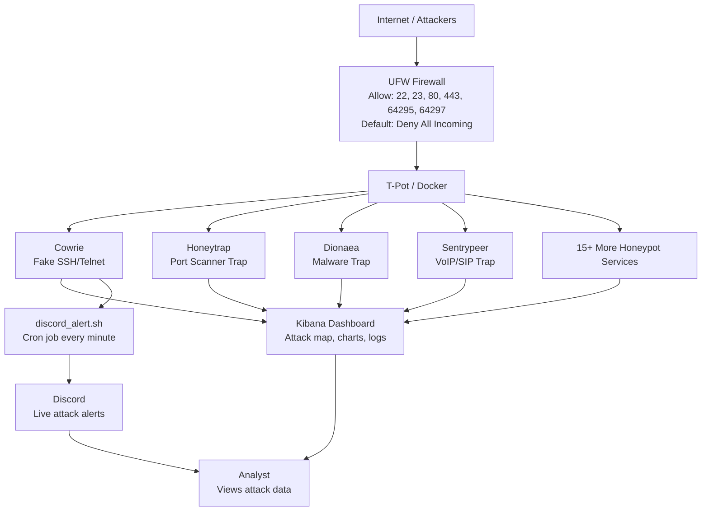

# Honeypot

A live honeypot deployed on a DigitalOcean cloud server to capture and analyze 
real-world attack behavior. Built using T-Pot (Telekom Security) on Ubuntu 24.04, 
the honeypot ran multiple trap services simultaneously including Cowrie (fake SSH), 
Honeytrap, Sentrypeer, Dionaea, and more — capturing over 55,000 attacks within 
24 hours of going live.

Attack data was visualized in real-time using an Elasticsearch/Kibana dashboard, 
revealing attacker origins, targeted ports, and credential attempts from across 
the globe. A UFW firewall was configured to control exposed attack surfaces while 
keeping management ports secured. Automated Discord alerts were set up via a webhook 
and cron jobs to deliver live attack notifications every minute.

## Server Architecture


### Flow Overview
- **Attackers** from the internet hit the **UFW Firewall** first
- UFW only allows traffic through on specific ports — everything 
  else is blocked by default
- Allowed traffic reaches **T-Pot's honeypot services** running 
  inside Docker containers (Cowrie, Honeytrap, Dionaea, Sentrypeer and more)
- All attack data is logged and visualized in the **Kibana Dashboard**
- Simultaneously the **discord_alert.sh** bash script runs every minute 
  via cron job, extracting Cowrie logs and sending live attack 
  notifications to **Discord**


## ⚙️ Specs & Security

### Cloud Server (DigitalOcean Droplet)
| Component | Requirement |
|---|---|
| **OS** | Ubuntu 24.04 LTS x64 |
| **RAM** | 8 GB minimum |
| **CPU** | 2-4 vCPUs |
| **Storage** | 160 GB SSD |
| **Region** | Any (Toronto used in this project) |
| **Provider** | DigitalOcean (or any cloud provider) |

### Software & Tools
| Tool | Purpose |
|---|---|
| **T-Pot (Telekom Security)** | Honeypot framework |
| **Elasticsearch & Kibana** | Attack data visualization |
| **Docker** | Runs all honeypot containers |
| **UFW** | Firewall configuration |
| **Cowrie** | Fake SSH/Telnet honeypot |
| **Discord Webhook** | Real-time attack alerts |
| **Cron** | Automated alert scheduling |
| **Git** | Cloning T-Pot repository |

### Secure Authentication
| Password Type | Purpose | Recommended Requirements |
|---|---|---|
| **DigitalOcean Root Password** | SSH access to the droplet as root | Min 8 chars, uppercase, lowercase, number, special character |
| **Non-Root User Password** | Daily server management as non-root user | Min 8 chars, uppercase, lowercase, number, special character |
| **T-Pot Web Password** | Login to Kibana/Elastic dashboard | Min 8 chars, no special characters (T-Pot restriction) |
| **Discord Webhook URL** | Authenticates alert script to Discord channel | Treat as a password — never share or commit to GitHub publicly |

## 🛠️Setup

### Step 1 — Create Droplet/ VPS

Cloud Provider: For this project, any cloud provider is fine, but I used DigitalOcean.


Pick Region: I picked Toronto because I am closest to it.


Choosing an image: For this project, I picked Ubuntu 24.04 LTS x64. DigitalOcean provides other images that would work fine for this project, like Debian, but since Ubuntu is directly supported by Telekom Security, I chose to go with it.


Authentication Method: SSH is a much safer option for authentication. In my case, I was only going to run this droplet for around 32 hours, and SSH is usually used for long-term servers. Using a password was quicker for the initial setup of the honeypot and worked better for analyzing real-time attack data. Thus, using a strong password is very important.


Improved Metrics Monitoring: For a server getting 1,800+ attacks an hour with 15+ T-Pot services running all at once inside Docker, it is very important to see whether the droplet can handle that attack load. This feature tracks network traffic, CPU usage, RAM consumption, and disk I/O.


---

## 🔗 T-Pot Repository

This project uses the official T-Pot framework developed by Telekom Security.
T-Pot is an all-in-one honeypot platform that runs 20+ honeypot services 
simultaneously inside Docker containers. If you would like to run these T-Pot services too, here is the GitHub repo link.

**Official Repository:** [Telekom Security T-Pot](https://github.com/telekom-security/tpotce)

---


---

## 🔥 UFW Firewall Configuration

To add an additional layer of security and control over the honeypot, 
UFW was configured on the droplet. The goal 
was to intentionally expose only the necessary ports to attract attackers 
while keeping management ports secured.

### Why UFW?
Without a firewall every port on the server is completely uncontrolled. 
UFW allowed full control over exactly what traffic could reach the server 
— blocking everything by default and only allowing specific ports through.

### Firewall Rules

| Port | Protocol | Reason |
|---|---|---|
| **64295** | TCP | New SSH management port (T-Pot changes default port 22) |
| **64297** | TCP | T-Pot Kibana dashboard access |
| **22** | TCP | Intentionally exposed — attracts SSH brute force attackers into Cowrie trap |
| **23** | TCP | Intentionally exposed — attracts Telnet attackers |
| **80** | TCP | Intentionally exposed — attracts HTTP based attacks |
| **443** | TCP | Intentionally exposed — attracts HTTPS based attacks |

### Key Detail
The default policy was set to **deny all incoming traffic** meaning 
any port not explicitly listed above is completely blocked. This gave 
full control over the attack surface while still allowing the honeypot 
traps to function properly.

### UFW Commands Used


### UFW Status


### `discord_alert.sh` (Discord Webhook Alert Agent)
```bash
#!/bin/bash
WEBHOOK_URL="Example URL"

ATTACKS=$(docker logs cowrie 2>&1 | grep "login attempt" | wc -l)
LATEST_IP=$(docker logs cowrie 2>&1 | grep "login attempt" | tail -1 | grep -oP '\d+\.\d+\.\d+\.\d+' | head -1)

curl -H "Content-Type: application/json" \
-d "{
  \"embeds\": [{
    \"title\": \"ALERT\",
    \"color\": 16711680,
    \"fields\": [
      {\"name\": \"Total SSH Attempts\", \"value\": \"$ATTACKS\", \"inline\": true},
      {\"name\": \"Latest Attacker IP\", \"value\": \"$LATEST_IP\", \"inline\": true}
    ],
    \"footer\": {\"text\": \"T-Pot HoneyPot Toronto\"}
  }]
}" \
$WEBHOOK_URL
```


